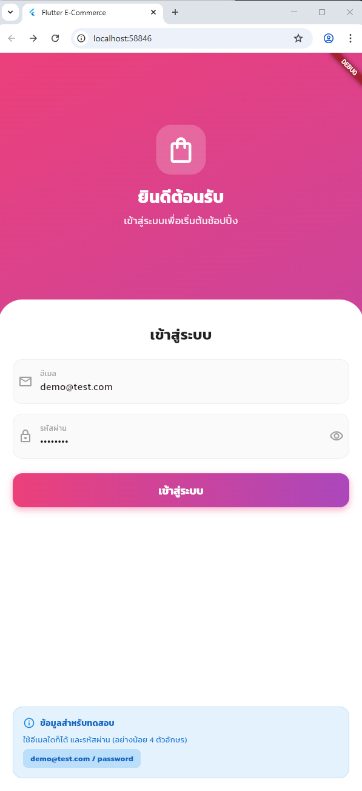
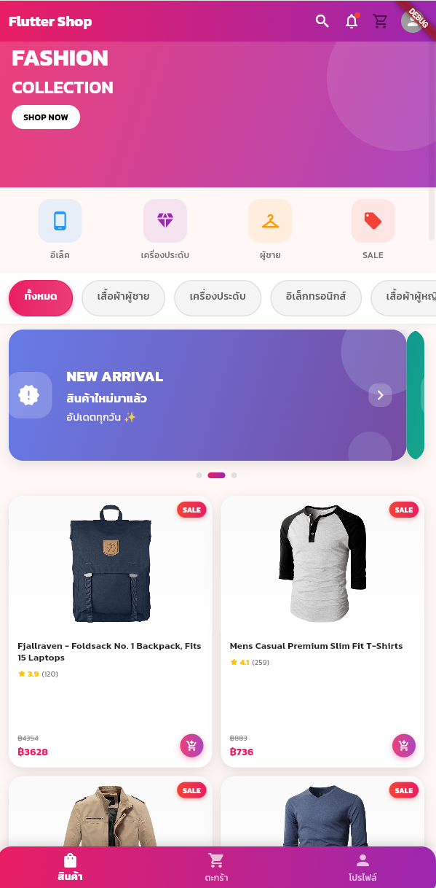
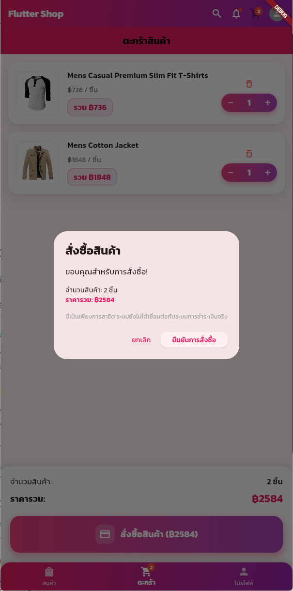

# Flutter E-Commerce Lab 🛒

A modern, beautiful Flutter e-commerce application with Thai language support and contemporary UI design.

## ✨ Features

### 🎨 Modern UI Design
- **Gradient Themes**: Beautiful pink-purple gradient throughout the app
- **Thai Font Support**: Kanit font family for beautiful Thai typography
- **Material Design 3**: Latest design principles with enhanced shadows and rounded corners
- **Auto-Slide Banners**: Promotional banners with automatic sliding carousel
- **Hero Animations**: Smooth transitions between product list and detail screens

### 🛍️ E-Commerce Functionality
- **Product Catalog**: Browse products with category filtering
- **Shopping Cart**: Add/remove items with quantity controls
- **Product Details**: Detailed product pages with enhanced UI
- **User Authentication**: Login system with session management
- **User Profile**: Profile management with modern design

### 🎯 Technical Highlights
- **State Management**: Provider pattern for efficient state management
- **API Integration**: RESTful API integration with proper error handling
- **Responsive Design**: Optimized for different screen sizes
- **Performance**: Optimized images and smooth animations
- **Thai Localization**: Complete Thai language support

## 🚀 Getting Started

### Prerequisites
- Flutter SDK (>=3.0.0)
- Dart SDK (>=3.0.0)
- Android Studio / VS Code
- Android Emulator or Physical Device

### Installation

1. **Clone the repository**
   ```bash
   git clone https://github.com/somkheartk/flutter-ecommerce-lab.git
   cd flutter-ecommerce-lab
   ```

2. **Install dependencies**
   ```bash
   flutter pub get
   ```

3. **Run the app**
   ```bash
   flutter run
   ```

## 📱 Screenshots

### Login Screen

*Login screen with gradient background and form validation*

### Product Catalog

*Auto-sliding promotional banners and product grid with category filters*

### Shopping Cart

*Shopping cart with quantity controls and checkout functionality*

> **Note**: Screenshots will be added after building and testing the application on actual devices.

## 📱 App Structure

```
lib/
├── main.dart                 # App entry point
├── models/                   # Data models
│   ├── product.dart
│   ├── user.dart
│   └── cart_item.dart
├── providers/                # State management
│   ├── auth_provider.dart
│   ├── product_provider.dart
│   └── cart_provider.dart
├── screens/                  # UI screens
│   ├── auth/
│   ├── home/
│   ├── product/
│   ├── cart/
│   └── contact/
└── widgets/                  # Reusable widgets
    └── product_card.dart
```

## 🎨 Design Features

- **Gradient Backgrounds**: Pink-purple gradients for modern look
- **Enhanced Shadows**: Multiple shadow layers for depth
- **Rounded Corners**: Consistent 16-20px border radius
- **Kanit Font**: Beautiful Thai typography
- **Interactive Elements**: Smooth ripple effects and animations

## 🛒 E-Commerce Features

### Product Management
- Product listing with category filters
- Product detail pages with hero animations
- Search functionality (coming soon)
- Product ratings and reviews display

### Shopping Cart
- Add/remove items with smooth animations
- Quantity controls with gradient design
- Cart persistence across sessions
- Checkout flow with order confirmation

### User Experience
- Auto-sliding promotional banners
- Smooth page transitions
- Loading states and error handling
- Thai language throughout the app

## 🔧 Development

### Architecture
- **MVVM Pattern**: Clear separation of concerns
- **Provider Pattern**: For state management
- **Repository Pattern**: For data layer abstraction

### Code Quality
- Consistent code formatting
- Comprehensive error handling
- Performance optimizations
- Responsive design principles

## 📸 Screenshots

*Coming soon - Screenshots of the beautiful UI*

## 🤝 Contributing

1. Fork the repository
2. Create your feature branch (`git checkout -b feature/AmazingFeature`)
3. Commit your changes (`git commit -m 'Add some AmazingFeature'`)
4. Push to the branch (`git push origin feature/AmazingFeature`)
5. Open a Pull Request

## 📄 License

This project is licensed under the MIT License - see the [LICENSE](LICENSE) file for details.

## � Documentation

- [📖 Thai Documentation](DOCS_TH.md) - Complete project documentation in Thai
- [🧩 Widget Usage Guide](WIDGET_GUIDE_TH.md) - Detailed widget usage guide in Thai
- [📱 Screenshots](screenshots/README.md) - Screenshots and UI examples

## �🙏 Acknowledgments

- [FakeStore API](https://fakestoreapi.com/) for product data
- [Kanit Font](https://fonts.google.com/specimen/Kanit) for Thai typography
- Flutter community for amazing packages and resources

---

**Built with ❤️ using Flutter and Dart**
